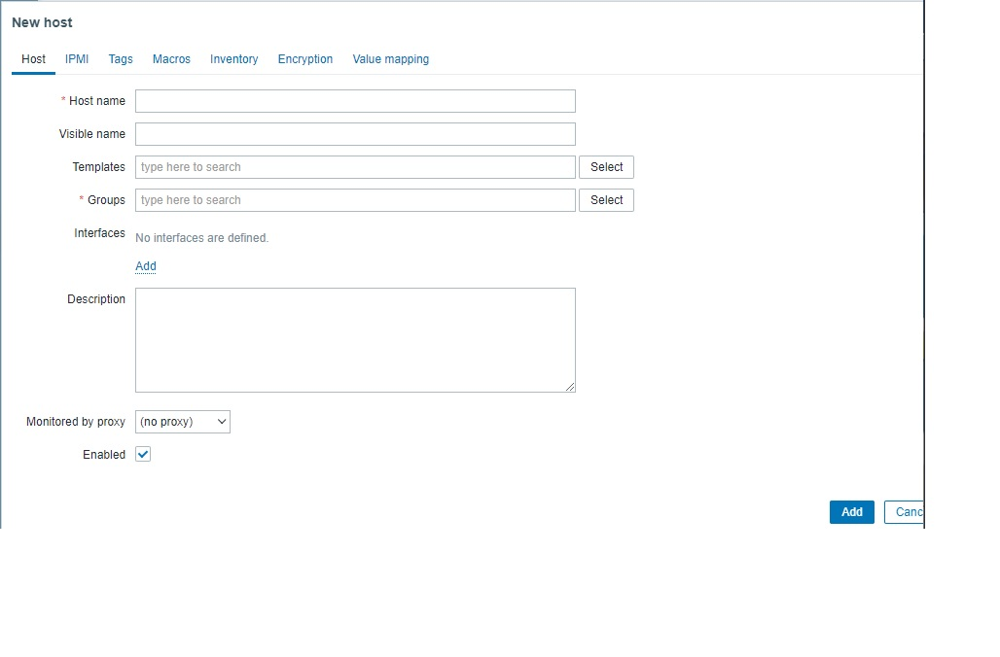
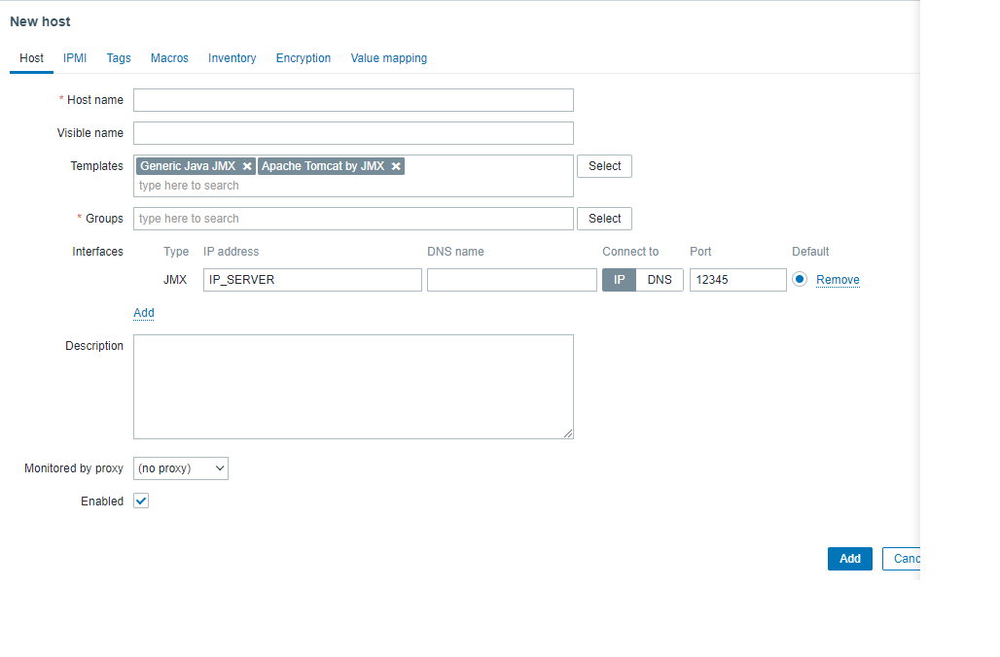

# Como conectar zabbix con tomcat.

## Prerequisitos

* Instalado zabbix.
* Instalado tomcat.


## Instalacion de zabbix java gateway

Lo primero que debemos de hacer es instalar el gateway de zabbix para java. Esto nos permitira recopilar los datos de estado del tomcat.

Para instalarlo primero debemos de añadir el repositorio:

```bash
rpm -Uvh https://repo.zabbix.com/zabbix/6.0/rhel/8/x86_64/zabbix-release-6.0-1.el8.noarch.rpm
```

Tras tener el repositorio añadido, debemos de instalar el gateway de zabbix:

```bash
yum install zabbix-java-gateway
```

## Configuracion de zabbix java gateway

Para eso debemos de dirigirnos aL siguiente archivo:

```bash
/etc/zabbix/zabbix_java_gateway.conf
```

En el configuramos los siguientes parametros:

```bash
# This is a configuration file for Zabbix Java Gateway.
# It is sourced by startup.sh and shutdown.sh scripts.

### Option: zabbix.listenIP
#       IP address to listen on.
#
# Mandatory: no
# Default:
LISTEN_IP="127.0.0.1"  #<--Este es uno de los parametros a configurar.

### Option: zabbix.listenPort
#       Port to listen on.
#
# Mandatory: no
# Range: 1024-32767
# Default:
LISTEN_PORT=10052 #<--Este es otro de los parametros a configurar.

### Option: zabbix.pidFile
#       Name of PID file.
#       If omitted, Zabbix Java Gateway is started as a console application.
#
# Mandatory: no
# Default:
# PID_FILE=

PID_FILE="/var/run/zabbix/zabbix_java_gateway.pid"

### Option: zabbix.startPollers
#       Number of worker threads to start.
#
# Mandatory: no
# Range: 1-1000
# Default:
START_POLLERS=5 #<--Este es el ultimo de los parametros a configurar.

### Option: zabbix.timeout
#       How long to wait for network operations.
#
# Mandatory: no
# Range: 1-30
# Default:
# TIMEOUT=3

### Option: zabbix.propertiesFile
#       Name of properties file. Can be used to set additional properties in a such way that they are not visible on
#       a command line or to overwrite existing ones.
# Mandatory: no
# Default:
# PROPERTIES_FILE=

# uncomment to enable remote monitoring of the standard JMX objects on the Zabbix Java Gateway itself
#JAVA_OPTIONS="$JAVA_OPTIONS -Dcom.sun.management.jmxremote -Dcom.sun.management.jmxremote.port=12345
#       -Dcom.sun.management.jmxremote.authenticate=false -Dcom.sun.management.jmxremote.ssl=false
#       -Dcom.sun.management.jmxremote.registry.ssl=false"
```

Una vez configurado, debemos de iniciar el gateway:

```bash
systemctl start zabbix-java-gateway
systemctl enable zabbix-java-gateway
```

Ahora debemos de configurar el server para que use el java gateway:

En el archivo de configuracion de zabbix(`/etc/zabbix/zabbix_server.conf`) debemos de agregar lo siguiente:	

```bash
JavaGateway=192.168.3.14 #<-- Es la ip del server donde esta corriendo el gateway.
JavaGatewayPort=10052 #<-- Puerto que hemos declarado en el archivo de configuracion del gateway.
StartJavaPollers=5
```

Ahora debemos de reiniciar la configuracion del server:

```bash
zabbix_server -c /etc/zabbix/zabbix_server.conf -R config_cache_reload
zabbix_server -R config_cache_reload
```

Por ultimo par terminar con la configuracion de zabbix debemos de activar el debugging en el gateway:

En el archivo de log de Zabbix-Java-Gateway(`/var/log/zabbix/zabbix_java_gateway.log`) debemos de modificar lo siguiente:

```bash
<configuration scan="true" scanPeriod="15 seconds">
[...]
      <root level="info">
              <appender-ref ref="FILE" />
      </root>
</configuration>
```

Donde pone _**info**_ debemos de poner _**debug**_. Esta parte de la configuracion esta al final del archivo; se recomienda mantener el original debido a que el debug se carga el archivo.


## Configuracion de tomcat.

Una vez instalado el tomcat podemos proceder a configurarlo, para que se puedan ver los procesos en zabbix.

Lo primero que debemos de hacer es ir a: `/carpeta_instalacion_tomcat/bin`

Una vez en esa carpeta debemos de crear el siguiente archivo: `setenv.sh` y añadirle lo siguiente:

```bash
export CATALINA_OPTS="$CATALINA_OPTS -Dcom.sun.management.jmxremote -Dcom.sun.management.jmxremote.port=12345 -Dcom.sun.management.jmxremote.ssl=false -Dcom.sun.management.jmxremote.authenticate=false -Djava.rmi.server.hostname=IP_SERVIDOR -Djava.net.preferIPv4Stack=true"
```

Una vez hecho esto debemos de darle los permisos adecuados a este archivo: `chmod 755 setenv.sh` y ejecutar lo siguiente: `./startup.sh`.

Para comprobar si funciona debemos de ejecutar lo siguiente:
```bash
ps -eaf | grep tomcat
ps -eaf | grep jmx
netstat -nl | grep -E -i "proto|8080|12345"
```

Para que esto funcione el firewall o esta deshabilitado o devemos deañadir una regla que permita a jmx y a java gateway comunicarse.

Ahora debemos de añadir un nuevo host en zabbix:

Para ello debemos de ir la parte de configuracion -> hosts y darle arriba a la derechar a `Crear nuevo host`

Nos aparecera lo siguiente:



* En el campo de host name ponemos el nombre que queramos que se muestre en zabbix.
* En templates debemos de buscar por JMX y añadir **Generic Java JMX** y  **Apache Tomcat by JMX**
* En la parte de groups podemos crear un nuevo grupo llamado **Tomcat**.
* Ahora debemos de darle en la parte de interfaces al boton `Add` y seleccionar **JMX**.

Nos deberia de quedar algo asi:



Solo queda darle al boton de _Add_ y el host se creara.